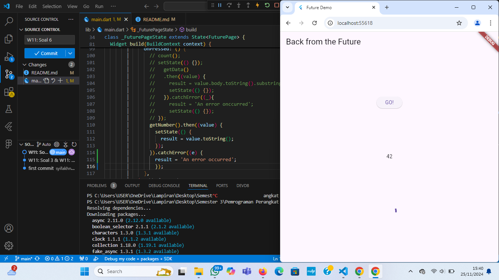

# Praktikum Pemrograman Asynchronous
Nama: Syifa Kharisma Nayla
NIM: 362358302019
Kelas: 2B TRPL

# Praktikum 1: Mengunduh Data dari Web Service (API)
(W11: Soal 4)
- Mencari judul buku favorite di google books, lalu ganti ID buku pada variabel path di kode tersebut. Dan kemudian akses di browser URI tersebut dengan lengkap.
Hasil:

- Tambah kode di ElevatedButton, lalu lakukan run aplikasi Flutter. Hasilnya seperti gambar di bawah ini.
Hasil:

- Substring adalah metode atau fungsi dalam banyak bahasa pemrograman yang digunakan untuk mengambil bagian tertentu dari sebuah string (sub-bagian string). Fungsi ini biasanya menerima parameter awal (index) dan akhir (opsional) untuk menentukan bagian string yang ingin diambil.
- catchError biasanya merujuk pada mekanisme penanganan error (kesalahan) dalam bahasa pemrograman.

#  Praktikum 2: Menggunakan await/async untuk menghindari callbacks
(W11: Soal 4)

- Langkah 1 :
Kode tersebut mensimulasikan operasi yang membutuhkan waktu tertentu dengan penundaan menggunakan Future.delayed. Hal ini berguna dalam mengelola proses asinkron dalam aplikasi.

- Langkah 2 : 
Kode tersebut adalah fungsi asinkron dalam bahasa Dart yang menghitung total nilai yang diperoleh dari tiga fungsi returnOneAsync, returnTwoAsync, dan returnThreeAsync. Fungsi ini juga memperbarui tampilan (UI) dengan memanfaatkan setState untuk mengubah nilai variabel result.

# Praktikum 3: Menggunakan Completer di Future 
(W11: Soal 5)

Kode pada langkah 2 bertujuan untuk membuat Future secara manual menggunakan Completer. Menunda hasil dengan menunggu selama 5 detik. Dan menyelesaikan Future dengan nilai 42 menggunakan completer.complete.

(W11: Soal 6)

- Langkah 5 :
Kode tersebut adalah fungsi asinkron bernama calculate, yang menggunakan blok try-catch untuk menangani kemungkinan kesalahan saat menjalankan operasi asinkron.

- Langkah 6 :
Kode tersebut adalah contoh penggunaan Future, yang memanfaatkan metode then dan catchError untuk menangani hasil sukses atau error dari operasi asinkron.

# Praktikum 4: Memanggil Future secara paralel
(W11: Soal 7)

Menambahkan method ke dalam class _FuturePageState lalu hapus atau comment kode sebelumnya, kemudian panggil method dari langkah 1 tersebut. Hasilnya akan terlihat seperti gambar di atas.
(Soal 8)
Perbedaan Langkah 1 dan Langkah 4:
- FutureGroup: Memberikan kontrol lebih untuk menambahkan dan mengelola Future secara dinamis.
Cocok untuk skenario yang lebih kompleks.
- Future.wait:Lebih sederhana, langsung menerima daftar Future.
Digunakan untuk kasus sederhana ketika semua Future sudah diketahui sejak awal.

# Praktikum 5: Menangani Respon Error pada Async Code
(W11: Soal 9)

Menambahkan method ke dalam class _FuturePageState, lakukan run dan klik tombol GO! maka akan menghasilkan seperti gambar berikut.
(Soal 10)
Perbedaan Langkah 1 dan Langkah 4:
- Langkah 1: Menggunakan try-catch-finally untuk menangani error dan memastikan blok finally tetap dijalankan.
- Langkah 4: Lebih berfokus pada UI, menggunakan setState() untuk memperbarui tampilan.

# Praktikum 6: Menggunakan Future dengan StatefulWidget
(Soal 11)
Menambahkan nama panggilan Anda pada tiap properti title sebagai identitas pekerjaan Anda.
(W11: Soal 12)

Memanggil screen baru tersebut di file main Anda seperti berikut. Selanjutnya, Run project di device atau emulator dan Tambahkan animasi loading. Maka, hasilnya akan terlihat seperti digambar